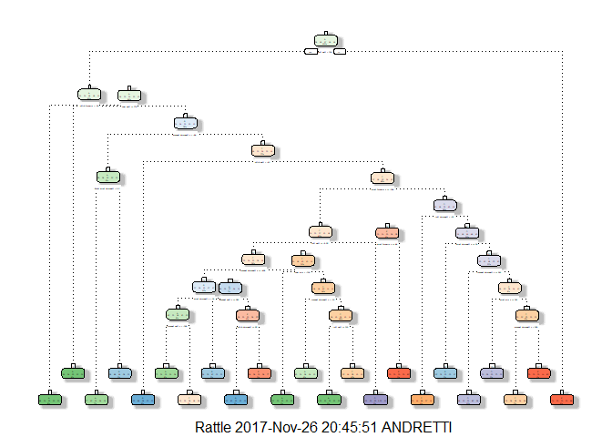
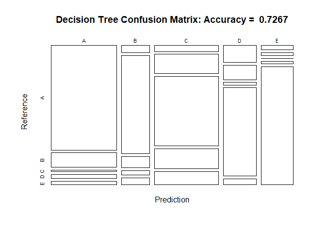
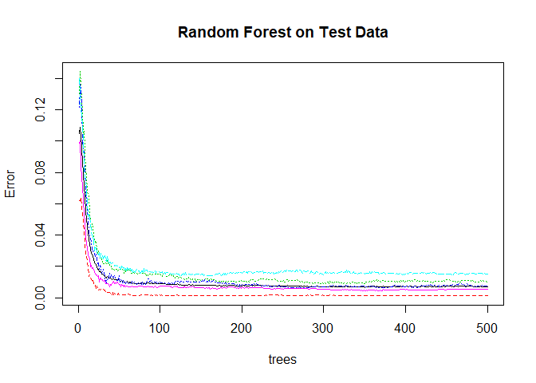
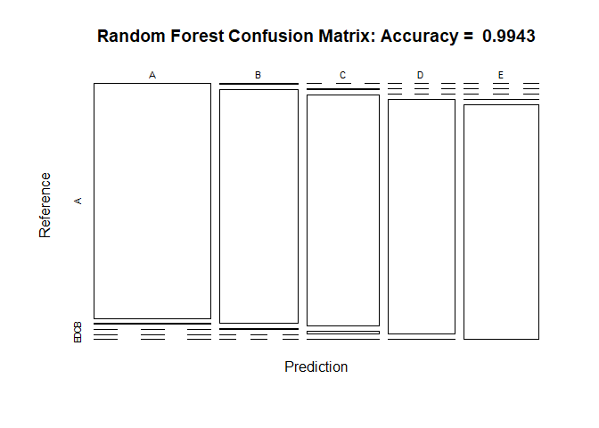

## Practical Machine Language Course Project

### Introduction

Using devices such as *Jawbone Up*, *Nike FuelBand*, and *Fitbit* it is now possible to collect a large amount of data about personal activity relatively inexpensively. These type of devices are part of the quantified self movement – a group of enthusiasts who take measurements about themselves regularly to improve their health, to find patterns in their behavior, or because they are tech geeks. One thing that people regularly do is quantify how much of a particular activity they do, but they rarely quantify __*how well they do it*__. In this project, your goal will be to use data from accelerometers on the belt, forearm, arm, and dumbell of 6 participants. They were asked to perform barbell lifts correctly and incorrectly in 5 different ways. More information is available from the website here: http://web.archive.org/web/20161224072740/http:/groupware.les.inf.puc-rio.br/har (see the section on the Weight Lifting Exercise Dataset).

### Purpose

The purpose of this project is to figure out the manner in which the test sbujects executed their exercices and build a model to predict the outcomes of the exercices based on the provided data.  Analysis of data was conducted based on the "*classe*" variable and other covariates of the training data set.

### Project Data


```r
set.seed(12345)

# Load data from files
train <- read.csv("data/pml-training.csv", na.strings = c("NA","#DIV/0!",""))
dim(train)
```

```
## [1] 19622   160
```

```r
test <- read.csv("data/pml-testing.csv", na.strings = c("NA","#DIV/0!",""))
dim(test)
```

```
## [1]  20 160
```

### Exploratory analysis

Look for variables with NA or missing values


```r
prop_na_vars <- colMeans(is.na(train))
table(prop_na_vars)
```

```
## prop_na_vars
##                 0 0.979308938946081 0.979359902150647 0.979410865355213 
##                60                67                 1                 1 
## 0.979512791764346 0.979563754968912 0.979767607787178 0.979818570991744 
##                 1                 4                 1                 4 
##  0.97986953419631 0.980939761492203 0.983233105697686 0.983284068902253 
##                 2                 2                 1                 1 
## 0.983385995311385 0.983538884925084  0.98358984812965 0.983640811334217 
##                 2                 1                 4                 2 
##                 1 
##                 6
```

```r
prop_na_rows <- rowMeans(is.na(train))
table(prop_na_rows)
```

```
## prop_na_rows
##  0.0375    0.05  0.0625 0.06875   0.075 0.08125 0.09375 0.10625  0.1125 
##     217      21      70       3       9      72       4       1       6 
##   0.125  0.1375   0.175   0.625 
##       1       1       1   19216
```

There are 60 variables and 19,216 rows with values that are at least 62.5% complete that can be used for prediction analysis.

### Cleaning data sets

#### Remove variables with missing (NA) values.


```r
train <- train[,colSums(is.na(train))==0]
test <- test[,colSums(is.na(test))==0]
```


#### Remove other variables from the data set that are not directly related to exercise data.


```r
train <- train[-c(1:6)]
```

### Splitting training data for analysis and prediction testing


```r
inTrain <- createDataPartition(train$classe, p=0.6, list=FALSE)
training <- train[inTrain,]
testing <- train[-inTrain,]
```


Exclude near-zero variance variables (predictors) and remove the index variable (first variable of the dataset).  The NZV variables are removed as those variables and values do not contribue to formulate a predictive model.


```r
nzv <- nearZeroVar(training, saveMetrics=TRUE)
training <- training[,nzv$nzv==FALSE]
training <- training[c(-1)]

nzv <- nearZeroVar(testing, saveMetrics=TRUE)
testing <- testing[,nzv$nzv==FALSE]
testing <- testing[c(-1)]

dim(training)
```

```
## [1] 11776    53
```

```r
dim(testing)
```

```
## [1] 7846   53
```

### Cleaning test data


```r
trainColNames <- colnames(training)
trainColNames_noClasse <- colnames(training[,-53])
testing <- testing[trainColNames]
test <- test[trainColNames_noClasse]

dim(test)
```

```
## [1] 20 52
```

## Prediction Algorithms 

Prediction of the outcome has been performed with Decision Trees and Random Forests.


## Predicting with Decision Trees


```r
modFitx1 <- rpart(classe ~ ., data=training, method="class")
fancyRpartPlot(modFitx1)
```

<!-- -->

```r
predictX1 <- predict(modFitx1, testing, type="class")
confMtx <- confusionMatrix(predictX1, testing$classe)
confMtx
```

```
## Confusion Matrix and Statistics
## 
##           Reference
## Prediction    A    B    C    D    E
##          A 1879  260   30   69   66
##          B   56  759   88   34   54
##          C  105  340 1226  354  234
##          D  155  132   23  807   57
##          E   37   27    1   22 1031
## 
## Overall Statistics
##                                           
##                Accuracy : 0.7267          
##                  95% CI : (0.7167, 0.7366)
##     No Information Rate : 0.2845          
##     P-Value [Acc > NIR] : < 2.2e-16       
##                                           
##                   Kappa : 0.6546          
##  Mcnemar's Test P-Value : < 2.2e-16       
## 
## Statistics by Class:
## 
##                      Class: A Class: B Class: C Class: D Class: E
## Sensitivity            0.8418  0.50000   0.8962   0.6275   0.7150
## Specificity            0.9243  0.96334   0.8405   0.9441   0.9864
## Pos Pred Value         0.8155  0.76589   0.5427   0.6874   0.9222
## Neg Pred Value         0.9363  0.88928   0.9746   0.9282   0.9389
## Prevalence             0.2845  0.19347   0.1744   0.1639   0.1838
## Detection Rate         0.2395  0.09674   0.1563   0.1029   0.1314
## Detection Prevalence   0.2937  0.12631   0.2879   0.1496   0.1425
## Balanced Accuracy      0.8831  0.73167   0.8684   0.7858   0.8507
```

```r
plot(confMtx$table, col=confMtx$byClass, main=paste("Decision Tree Confusion Matrix: Accuracy = ", round(confMtx$overall['Accuracy'],4)))
```

<!-- -->

## Predicting with Random Forests


```r
modFitX2 <- randomForest(classe~., data=training)
predictX2 <- predict(modFitX2, testing, type="class")
confMtxRndForest <- confusionMatrix(predictX2, testing$classe)
confMtxRndForest
```

```
## Confusion Matrix and Statistics
## 
##           Reference
## Prediction    A    B    C    D    E
##          A 2229    7    0    0    0
##          B    3 1505    5    0    0
##          C    0    6 1363   16    2
##          D    0    0    0 1268    4
##          E    0    0    0    2 1436
## 
## Overall Statistics
##                                           
##                Accuracy : 0.9943          
##                  95% CI : (0.9923, 0.9958)
##     No Information Rate : 0.2845          
##     P-Value [Acc > NIR] : < 2.2e-16       
##                                           
##                   Kappa : 0.9927          
##  Mcnemar's Test P-Value : NA              
## 
## Statistics by Class:
## 
##                      Class: A Class: B Class: C Class: D Class: E
## Sensitivity            0.9987   0.9914   0.9963   0.9860   0.9958
## Specificity            0.9988   0.9987   0.9963   0.9994   0.9997
## Pos Pred Value         0.9969   0.9947   0.9827   0.9969   0.9986
## Neg Pred Value         0.9995   0.9979   0.9992   0.9973   0.9991
## Prevalence             0.2845   0.1935   0.1744   0.1639   0.1838
## Detection Rate         0.2841   0.1918   0.1737   0.1616   0.1830
## Detection Prevalence   0.2850   0.1928   0.1768   0.1621   0.1833
## Balanced Accuracy      0.9987   0.9951   0.9963   0.9927   0.9978
```

```r
plot(modFitX2,main="Random Forest on Test Data")
```

<!-- -->

```r
plot(confMtxRndForest$table, col=confMtxRndForest$byClass, main=paste("Random Forest Confusion Matrix: Accuracy = ",round(confMtxRndForest$overall['Accuracy'],4)))
```

<!-- -->

## Predicting on the Test data


```r
predictTest <- predict(modFitX2,test,type="class")
predictTest
```

```
##  1  2  3  4  5  6  7  8  9 10 11 12 13 14 15 16 17 18 19 20 
##  B  A  B  A  A  E  D  B  A  A  B  C  B  A  E  E  A  B  B  B 
## Levels: A B C D E
```

## Conclusion

Predicting with Random Forests yield a greater accurracy compared to predicting with Prediction Trees.  The "out of sample" error is much smaller for the Random Forest prediction --- 0.0057% --- as opposed to 0.2733% for Prediction Trees.

